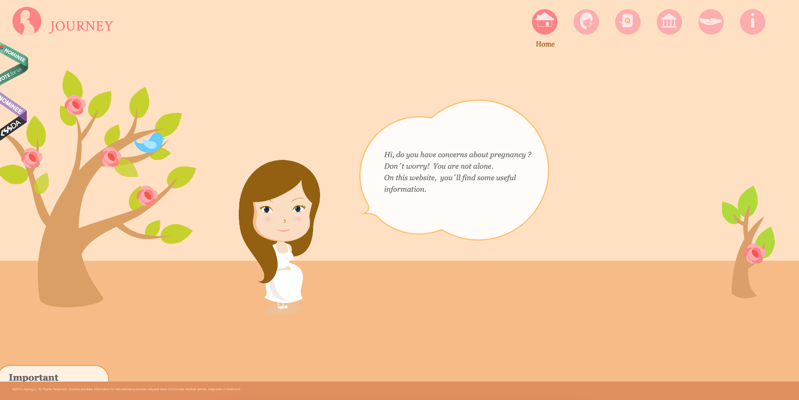
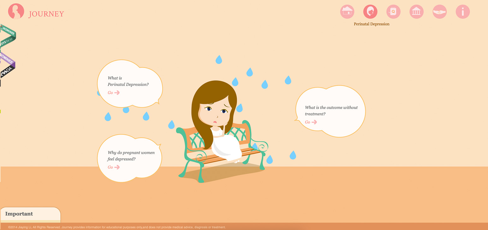
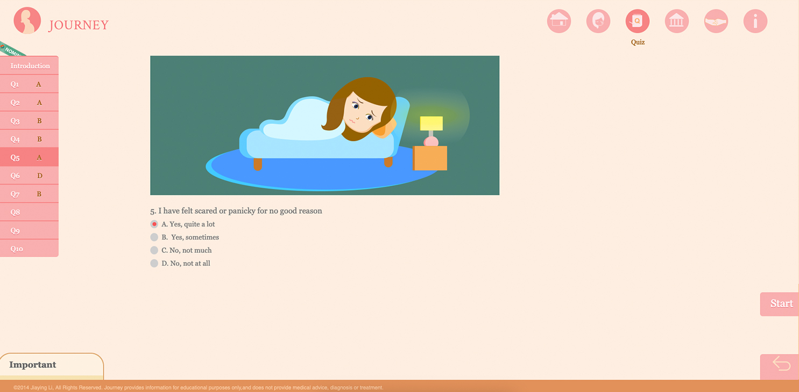

<h1 align="center" id="top">JOURNEY Website</h1>

## About the Project
This website aims to apply Emotional Design methods to medical education information and build emotional connections with users. The website introduces information about depression during pregnancy.
 

**Main Features:**

* Using Storytelling Illustration Methods to Visualization Information about Depression during Pregnancy 
* Interactive screening test

## Built With

- [HTML]
- [CSS]
- [JavaScrip]
- [JQuery]
